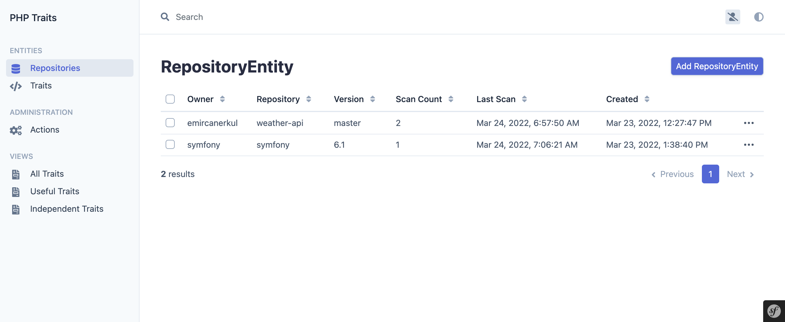
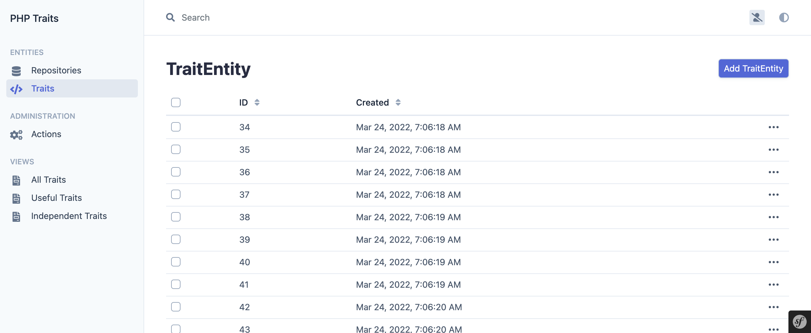
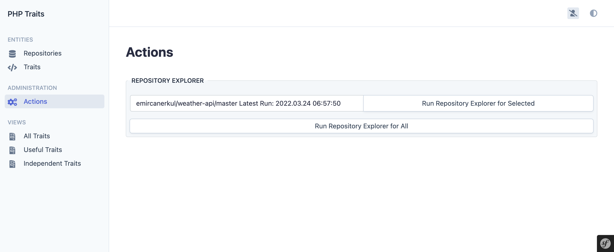
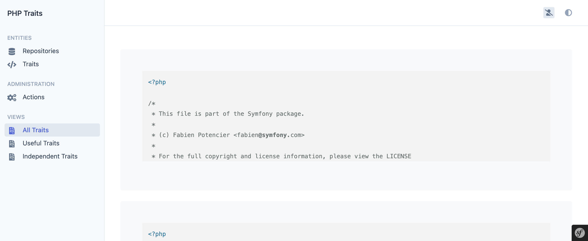

# Traits

PHP Trait Library & Discoverer & Manager

### Todo

- [ ] Enrich trait entity properties
  - [ ] Implement PhpDocExtractor to automatically get more detail about the file
  - [ ] Implement Php Analyser to determine if any dependencies are there
  - [ ] Add flags (taxonomies) to enrich categorization
- [ ] Implement a static site generator with client-side search abilities for views

### Previews

